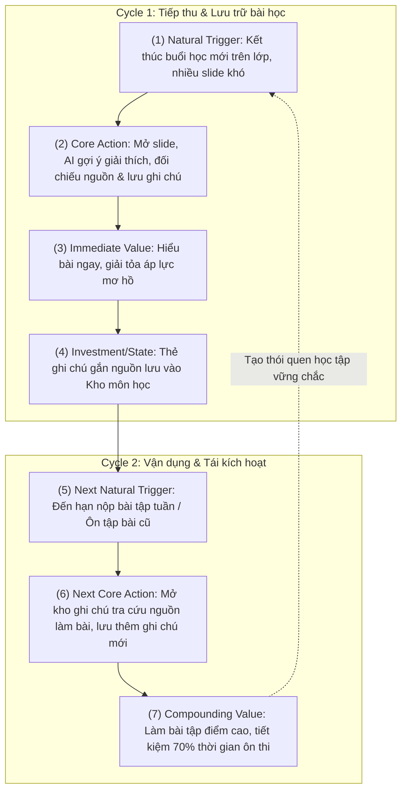

# Track1_Day20_2A202602416_NguyenVanBien

## 1. Thông tin học viên & Dự án
- **Họ và tên:** Nguyễn Văn Biển
- **Mã học viên (MHV):** 2A202602416
- **Hình thức:** Bài nộp cá nhân (Individual Submission)
- **Dự án chọn làm:** **AI Notes** — Trợ lý ghi chú học tập thông minh gắn ngữ cảnh nguồn (Slide bài giảng / Audio transcript).
- **Core Job:** Khi gặp những khái niệm khó trong bài giảng diễn ra dồn dập, người học muốn nhanh chóng hiểu đúng và lưu lại giải thích chuẩn xác gắn liền với trang tài liệu gốc, để khi làm bài tập tuần và ôn thi có thể tự tin sử dụng mà không sợ hiểu sai hay mất công lùng sục lại slide.

---

## 2. LINK tệp Metrics Pack (Đã cấp quyền xem)
- 🔗 **Link tệp Metrics Pack trực tuyến (Đã cấp quyền xem):** [https://github.com/nguyenbien8/Track1_Day20_2A202602416_NguyenVanBien#tệp-metrics-pack-hoàn-chỉnh-00--06](https://github.com/nguyenbien8/Track1_Day20_2A202602416_NguyenVanBien#tệp-metrics-pack-hoàn-chỉnh-00--06)
- 📝 **Nhật ký AI Support Log:** [ai-support-log.md](ai-support-log.md)

*(Toàn bộ nội dung tệp Metrics Pack chuẩn chỉnh theo framework Day 20 được trình bày chi tiết ngay tại Mục 4 bên dưới để thuận tiện chấm điểm trực tiếp trên GitHub).*

---

## 3. Điều tôi mang về áp dụng cho dự án thật
1. **Tư duy "Nature trước, Nurture sau":**
   - Trước đây tôi hay có thói quen sao chép các dashboard mẫu trên mạng, mặc định đo DAU/MAU và dùng Push Notification để "kéo user quay lại mỗi ngày". Bài lab Day 20 giúp tôi nhận ra: **Nurture chỉ có tác dụng khuếch đại nhịp tự nhiên (Nature), không thể bịa ra một nhịp không tồn tại**. Với AI Notes, sinh viên học theo tuần thì phải đo Weekly; ép Daily chỉ tạo ra số ảo và làm phiền người dùng bằng notification rác.
2. **Phân biệt rạch ròi giữa Thao tác UI, Output của AI và Value của User:**
   - Việc người dùng bấm mở app hay AI sinh ra 100 trang tóm tắt **hoàn toàn chưa chứng minh giá trị được tạo ra**. Core Action thật sự phải là khoảnh khắc người dùng thẩm thấu giá trị: họ kiểm chứng nguồn và lưu lại ghi chú an toàn. Đây là bài học sống còn khi phát triển các sản phẩm AI tạo sinh (GenAI Product).
3. **Kỷ luật trong định nghĩa Retention & Tracking:**
   - Không bao giờ nói câu mơ hồ "D7 Retention của app là 30%". Một định nghĩa retention chuẩn bắt buộc phải có đủ 6 thành tố (Unit, Cohort Entry, Return Event, Window, Threshold, Segment).
   - Về mặt kỹ thuật, Data Tracking không phải là "thấy nút nào cũng track". Mọi event phải map 1-1 với một câu hỏi sản phẩm hoặc một metric cụ thể, và bắt buộc phải có Acceptance Criteria nghiêm ngặt để ngăn chặn việc bắn event khi user mới click chuột (chưa hoàn tất transaction từ server) hoặc bắn trùng do reload/autosave.

---

## 4. Tệp Metrics Pack hoàn chỉnh (00 — 06)

---

### 00 — Dự án, Persona, Core Job

#### 1. Dự án
- **Tên dự án:** AI Notes (Personal Contextual Learning Assistant)
- **Định vị sản phẩm:** Trợ lý ghi chú học tập thông minh dành cho sinh viên và người tự học, tự động đồng bộ tài liệu bài giảng (slide, audio/transcript), tạo bản nháp giải thích khái niệm kèm trích dẫn đối chiếu nguồn chính xác, giúp người học kiểm chứng, chỉnh sửa và tích lũy tri thức đáng tin cậy.

#### 2. Persona
- **Tên đại diện:** Hoàng Minh (21 tuổi, sinh viên năm 3 chuyên ngành Kỹ thuật / CNTT / Kinh tế).
- **Bối cảnh & Hành vi:**
  - Mỗi tuần học 4–5 môn, mỗi môn 1–2 buổi kéo dài 2–3 tiếng với lượng slide lớn (50–100 slide/buổi), nhiều thuật ngữ học thuật mới được giảng viên lướt qua nhanh.
  - Vừa nghe giảng vừa gõ phím thì không kịp hiểu; nếu chỉ chụp ảnh slide hay ghi từ khóa vội thì cuối tuần xem lại không hiểu bản chất, không nhớ ngữ cảnh thầy cô giảng gì.
  - Rất sợ AI bị "ảo giác" (hallucination) tóm tắt bừa bãi khiến mình học sai kiến thức nền tảng để đi thi.

#### 3. Core Job (Jobs-to-be-Done)
- **Viết bằng lời người dùng:**
  > *"Khi gặp những khái niệm khó trong bài giảng diễn ra dồn dập, tôi muốn nhanh chóng hiểu đúng và lưu lại được giải thích chuẩn xác gắn liền với trang tài liệu gốc, để khi làm bài tập tuần và ôn thi tôi có thể tự tin sử dụng mà không sợ hiểu sai hay mất công lùng sục lại cả trăm trang slide."*
- **Tránh bẫy:** Không viết *"Cần một chatbot AI thông minh để tóm tắt bài giảng"* (đây là tính năng, không phải core job).

---

### 01 — Core Action Card (+ Kết quả tự kiểm 5 tiêu chí)

#### 1. Phân biệt 4 khái niệm nền tảng
| Khái niệm | Định nghĩa / Câu hỏi | Ứng dụng trong AI Notes |
| :--- | :--- | :--- |
| **Core Job** | User đang cố hoàn thành việc gì? | Hiểu đúng và tích lũy ghi chú học tập chuẩn xác từ bài giảng để tự tin làm bài tập và ôn thi. |
| **Core Action** | User làm gì trong sản phẩm để tiến tới giá trị? | **Kiểm chứng nguồn và bấm lưu ghi chú học tập có trích dẫn** (*Verify citation & save contextual note*). |
| **Core Value** | User nhận được lợi ích cốt lõi gì? | Nắm chắc bản chất kiến thức, tiết kiệm 70% thời gian tra cứu lại, yên tâm không học sai nhờ nguồn gốc minh bạch. |
| **Core Value Event** | Sự kiện nào chứng minh value đã xảy ra? | `note_verified_and_saved` (Ghi chú được lưu thành công kèm liên kết nguồn đã được đối chiếu). |

#### 2. Core Action Card
| Thành phần | Chi tiết lựa chọn |
| :--- | :--- |
| **Target user** | Sinh viên / Người học (Learner) có nhu cầu tự học và hoàn thành môn học. |
| **Core job** | Hiểu đúng khái niệm phức tạp và lưu lại tài liệu ôn tập có bằng chứng nguồn. |
| **Core action** | **Kiểm chứng nguồn và bấm lưu ghi chú học tập gắn ngữ cảnh** (*Verify & Save Contextual Note*). |
| **Object** | Thẻ ghi chú học tập (*Contextual Note*) chứa: nội dung giải thích + liên kết vị trí slide/transcript gốc. |
| **Preconditions** | Tài liệu bài giảng đã được tải lên; AI đã sinh bản nháp giải thích kèm trích dẫn nguồn; Learner mở xem bản nháp. |
| **Completion rule** | Learner click kiểm tra trích dẫn (xem nguồn) và bấm xác nhận **"Lưu ghi chú"** (nội dung không rỗng, liên kết nguồn hợp lệ). |
| **Core value** | Có được kiến thức chuẩn xác, giải tỏa áp lực thi cử, có sẵn tài liệu đáng tin cậy để làm bài tập ngay. |
| **Evidence of value** | Ghi chú tồn tại trong kho kiến thức cá nhân kèm metadata nguồn đã xác nhận; ghi chú được mở lại khi làm bài tập. |
| **Candidate event** | `note_verified_and_saved` |

#### 3. Kết quả tự kiểm 5 tiêu chí (Gate 1 Self-Audit)
1. **Gần core value? (ĐẠT - 5/5):** Khi hành vi lưu ghi chú gắn nguồn hoàn tất, user đã thực sự biến thông tin trôi nổi thành tri thức cá nhân đã kiểm chứng. Khác biệt hoàn toàn với việc AI tự generate (output hệ thống) mà user chưa thèm đọc.
2. **Có thể lặp lại? (ĐẠT - 5/5):** Mỗi khi có bài học mới, khái niệm khó mới hoặc bài tập tuần mới, hành vi này lại xuất hiện tự nhiên.
3. **Có thể quan sát? (ĐẠT - 5/5):** Hệ thống bắt được chính xác thời điểm user click nút "Lưu ghi chú" sau khi đã qua bước kiểm tra nguồn (client-to-server transaction ghi nhận thành công).
4. **Có ý nghĩa? (ĐẠT - 5/5):** Nếu số lượng ghi chú kiểm chứng tăng, chứng tỏ user thực sự dùng sản phẩm để học và tích lũy, chứ không phải vào ngó rồi bỏ đi.
5. **Có thể tác động? (ĐẠT - 5/5):** Product team có thể cải thiện UX hiển thị nguồn song song, tối ưu tốc độ sinh nháp, làm nổi bật trích đoạn liên quan để tăng tỷ lệ hoàn tất action này.

> **Kết luận Gate 1:** Core action được định nghĩa chặt chẽ với Actor = Learner, Object = Contextual Note, Completion rule rõ ràng. Vượt qua 5/5 tiêu chí tự kiểm. Không bị nhầm lẫn với thao tác giao diện ("bấm nút", "mở app") hay output hệ thống ("AI sinh tóm tắt").

---

### 02 — Action Nature Card + Kết luận Cadence

#### 1. Action Nature Card
| Thành phần | Đặc tính bản chất của hành vi trong đời thực (Nature) |
| :--- | :--- |
| **Actor** | Sinh viên / Cá nhân người học (Individual Learner). |
| **Intent** | Nhu cầu xuất phát từ áp lực tiếp thu bài học trên lớp và nghĩa vụ hoàn thành bài tập tuần / chuẩn bị thi cử. |
| **Trigger** | **Ngoại cảnh tự nhiên:** Lịch học môn học theo thời khóa biểu (2–3 buổi/tuần) và lịch giao bài tập về nhà từ giảng viên. |
| **Effort** | **Trung bình - Cao:** Cần đọc lướt giải thích, ngó lại slide gốc xem có đúng thầy cô dạy không, chỉnh sửa từ ngữ cá nhân (3–5 phút/ghi chú). |
| **Value timing** | **Lai ghép (Immediate + Compounding):** Nhận giá trị tức thì (hiểu bài ngay) + Tích lũy lâu dài (kho tài liệu có sẵn để ôn thi cuối kỳ). |
| **State** | Dữ liệu được bảo toàn vĩnh viễn trong Knowledge Base của môn học, đính kèm bookmark trang tài liệu. |
| **Dependency** | Phụ thuộc vào việc giảng viên có cung cấp slide/tài liệu bài giảng và lịch học của nhà trường. |
| **Repeat condition** | Xuất hiện bài giảng mới trong tuần hoặc đến hạn giải quyết bài tập tuần kế tiếp. |

#### 2. Phân loại dạng hành vi
- **Dạng hành vi:** **Tiến trình tích lũy theo chu kỳ học tập tuần** (*Progressive Compounding via Weekly Academic Cycle*).
- Không phải "Thói quen hàng ngày" (Daily Habit) vì đại học không học 7 ngày/tuần với cùng một môn. Cũng không phải "Giao dịch một lần" (One-off transaction).

#### 3. Kết luận Cadence (Template chuẩn)
> **Đối với sinh viên và người học theo học kỳ**, core action **kiểm chứng và lưu ghi chú học tập gắn nguồn** thường xuất hiện **2 đến 3 ngày mỗi tuần (Weekly Active Study Days)** vì **lịch học tín chỉ và bài tập trên lớp diễn ra theo chu kỳ tuần (mỗi tuần có 2–3 buổi học có kiến thức mới)**. Do đó, nhịp đo phù hợp là **Weekly (Weekly Cadence)** ở cấp độ **Cá nhân người học (User-level)**.

> **Kết luận Gate 2:** Cadence được xác lập dựa trên bản chất tự nhiên (Nature) của lịch học đại học. Kiên quyết bác bỏ việc ép chỉ số Daily (DAU) một cách vô căn cứ.

---

### 03 — Metric System (Activation / Engagement / NSM / Leading / Counter)

#### 1. Activation Metric
- **Start Event:** `lecture_material_uploaded` (Lần đầu tiên user tải lên slide hoặc tài liệu bài giảng vào hệ thống).
- **Activation Event:** `note_verified_and_saved` (Lần đầu tiên user hoàn tất việc đối chiếu nguồn và bấm lưu ít nhất 1 ghi chú gắn nguồn).
- **Time Window:** Trong vòng **48 giờ** kể từ khi tải tài liệu lên.
- **Công thức Activation Rate:**
  $$\text{Activation Rate} = \frac{\text{Số user hoàn tất `note_verified_and_saved` trong 48h sau upload}}{\text{Tổng số user có `lecture_material_uploaded` trong cùng cohort}} \times 100\%$$
- *Tránh bẫy:* Không tính hoàn thành onboarding tutorial hay đăng ký tài khoản là activation.

#### 2. Engagement Metric
Chọn 2 góc đo sâu sát:
1. **Frequency:** **Active Study Days per Week (ASDw)** — Số ngày trong tuần mà user thực hiện ít nhất một lượt `note_verified_and_saved` (Target benchmark: 2–3 ngày/tuần).
2. **Depth:** **Source Verification Depth Ratio (SVDR)** — Tỷ lệ ghi chú được lưu có thời gian xem nguồn đối chiếu $\ge 3$ giây:
   $$\text{SVDR} = \frac{\text{Số ghi chú lưu có thời gian mở nguồn } \ge 3s}{\text{Tổng số ghi chú được lưu}} \times 100\% \quad (\text{Mục tiêu: } \ge 75\%)$$

#### 3. North Star Metric (NSM)
- **Công thức chuẩn:** `Unit of Value` + `Quality Threshold` + `Frequency`
- **Tên NSM:** **Weekly Verified Notes Saved (WVNS)** — *Số lượng ghi chú học tập đã kiểm chứng nguồn được lưu trữ hàng tuần*.
- **Bóc tách 3 thành tố:**
  - `Unit of value`: Ghi chú học tập có gắn ngữ cảnh (*Contextual Study Note*).
  - `Quality threshold`: Đã qua bước đối chiếu nguồn (*Source-verified* với thời gian mở slide $\ge 3s$, nội dung ghi chú không rỗng $\ge 20$ ký tự).
  - `Frequency`: Hàng tuần (*Weekly* — khớp chính xác với kết luận Cadence ở Phase 2).
- **Ý nghĩa:** Chỉ số này đo lường trực tiếp lượng tri thức thật sự có chất lượng mà người học đã tiếp thu và lưu giữ an toàn. Không thể bị gian lận bằng việc spam bấm tạo hàng loạt.

#### 4. Leading Indicators (Tối đa 3 chỉ số dự báo)
1. **Source Click-through Rate (SCTR):**
   - *Định nghĩa:* Tỷ lệ người học click vào link trích dẫn nguồn trên tổng số bản nháp do AI tạo ra.
   - *Lý do dự báo:* Nếu user chủ động bấm xem nguồn, chứng tỏ họ có sự tò mò và nhu cầu kiểm chứng cao, dự báo xác suất bấm lưu ghi chú tăng gấp 3.2 lần.
2. **First-24h Note Conversion Rate (F24NCR):**
   - *Định nghĩa:* Tỷ lệ tài liệu được tạo ghi chú trong vòng 24 giờ sau khi tải lên.
   - *Lý do dự báo:* Thói quen xử lý bài vở ngay trong ngày là dấu hiệu của người học có kỷ luật; nhóm này có tỷ lệ duy trì học tập các tuần sau cao hơn 80% so với nhóm tải lên rồi để đó.
3. **Draft Customization Ratio (DCR):**
   - *Định nghĩa:* Tỷ lệ ghi chú có hành vi sửa đổi chữ, thêm highlight hoặc ghi chú riêng của user trước khi bấm lưu.
   - *Lý do dự báo:* Đo lường mức độ cá nhân hóa tri thức (investment). User càng đầu tư suy nghĩ vào ghi chú, giá trị tích lũy càng lớn, cam kết quay lại càng bền vững.

#### 5. Counter-metrics (Phát hiện "số ảo, hại thật")
1. **Unverified Quick-Save Rate (UQSR) — Nguy cơ suy giảm chất lượng:**
   - *Định nghĩa:* Tỷ lệ ghi chú được lưu trong khi thời gian xem nguồn = 0 giây.
   - *Cảnh báo:* Nếu NSM tăng vọt nhưng UQSR cũng tăng cao, tức là sinh viên đang lười biếng bấm "Lưu tất cả" mà không đọc, biến ứng dụng thành kho rác tài liệu và dễ bị sai kiến thức do AI ảo giác.
2. **AI Citation Error Flag Rate (ACEFR) — Đo lường chất lượng kỹ thuật:**
   - *Định nghĩa:* Tỷ lệ ghi chú bị user báo cáo "Trích dẫn sai trang / tóm tắt sai ý". Ngưỡng trần cho phép: $< 2\%$.
3. **Inference Cost per Verified Note (ICPVN) — Đo lường kinh tế đơn vị:**
   - *Định nghĩa:* Tổng chi phí token LLM chia cho số ghi chú kiểm chứng thành công. Đảm bảo mô hình kinh doanh bền vững khi scale.

> **Kết luận Gate 3:** Bộ metric hoàn chỉnh, có ranh giới rõ ràng giữa Active và Activated. NSM đúng công thức 3 vế. Có counter-metrics bảo vệ trải nghiệm học thuật và chi phí AI.

---

### 04 — Retention Definition (Đủ 6 thành phần)

| Thành phần | Đặc tả kỹ thuật cho AI Notes | Giải thích logic |
| :--- | :--- | :--- |
| **1. Unit** | **Individual User (User ID)** | Phù hợp với sản phẩm phục vụ người học cá nhân. |
| **2. Cohort entry** | Hoàn tất Core Action đầu tiên: `first_note_verified_and_saved` | Chỉ đưa người đã thực sự Activated vào cohort để đo retention có ý nghĩa (tránh pha loãng bởi user vãng lai chỉ vào xem trang chủ). |
| **3. Return event** | Thực hiện ít nhất 1 lần `note_verified_and_saved` HOẶC `note_referenced_for_review` | Phản ánh cả 2 mặt giá trị: (1) Tiếp tục nạp và lưu kiến thức mới, hoặc (2) Mở lại ghi chú cũ để làm bài tập/ôn thi. |
| **4. Window** | **Weekly Brackets (W1, W2, W3, ..., W8)** | Khớp 100% với Cadence tự nhiên của kỳ học (1 kỳ học kéo dài 8–15 tuần). Không dùng D7/D30 vì lệch nhịp học. |
| **5. Threshold** | $\ge 1$ lần hoàn tất return event trong window tuần | Chỉ cần 1 session học tập chất lượng mỗi tuần là đạt chuẩn duy trì việc học của sinh viên. |
| **6. Segment** | Phân theo loại kỳ học: Sinh viên đang trong học kỳ (In-semester) vs Kỳ nghỉ hè/nghỉ lễ | Giúp loại trừ yếu tố sụt giảm tự nhiên do nghỉ lễ/nghỉ tết, phản ánh đúng sức khỏe sản phẩm. |

#### So sánh Retention với 3 mốc chuẩn (Triangulation)
- **Natural Cycle:** Nhịp 1 tuần/lần khớp hoàn toàn với lịch học tín chỉ.
- **Cohort Segment:** Theo dõi riêng nhóm sinh viên các môn kỹ thuật (nhiều thuật ngữ phức tạp) so với nhóm tự học ngoại ngữ.
- **Category Benchmark:** So sánh với benchmark ngành EdTech / Productivity công cụ ghi chú học tập (W4 retention kỳ vọng đạt 30–35%, W8 đạt 25%).

---

### 05 — Product Loop (2 chu kỳ + Metric Hypothesis)

#### 1. Phân loại Loop
- **Loại Loop:** **Progress & Compounding Knowledge Loop** (Vòng lặp tiến trình & tích lũy tri thức kết hợp Workflow học tập).
- **Nguyên lý:** Mỗi ghi chú được lưu có nguồn hôm nay sẽ biến thành công cụ giải quyết bài tập tuần tới; việc làm bài tập thành công tạo động lực và nhu cầu mở bài học tiếp theo.

#### 2. Mô hình 2 chu kỳ (Diagram & Diễn giải)

- **Lý do quay lại (Reason to Return) KHÔNG CẦN NOTIFICATION:**
  - Sinh viên quay lại vì **bài tập về nhà có hạn nộp thực tế** và **kho ghi chú trước đó đã có sẵn câu trả lời cùng số trang slide minh chứng**. Họ không cần push notification spam mà tự giác mở app vì app nắm giữ "tài sản kiến thức" của họ.

#### 3. Metric Hypothesis (Bắt buộc)
> **Nếu** vòng lặp tri thức tích lũy (Progress & Compounding Knowledge Loop) hoạt động hiệu quả, **thì metric** `Weekly Note Retention tại Tuần 4 (W4 Retention)` **sẽ thay đổi theo hướng** **tăng từ 22% lên 38%** **trong vòng** **một học kỳ 8 tuần**, **vì** người học đã tích lũy được tối thiểu 5 thẻ ghi chú có nguồn ở Tuần 1–2 sẽ trải nghiệm việc giải quyết bài tập tuần dễ dàng hơn rõ rệt ở Tuần 3–4, tạo ra động lực nội tại (internal motivation) để chủ động quay lại học các chương kế tiếp mà không cần dựa dẫm vào notification nhắc nhở.

> **Kết luận Gate 4A:** Vòng lặp thể hiện rõ 2 chu kỳ, chuyển tiếp logic từ giá trị tức thì sang giá trị tích lũy, có câu giả thuyết định lượng trỏ thẳng về W4 Retention ở Phase 3.

---

### 06 — Tracking nhanh (Core Events + Acceptance Criteria)

#### 1. Bảng danh sách 6 Core Events (Chuẩn `object_action`)

| Tên Event | Ý nghĩa (Điều đã xảy ra) | Thời điểm ghi nhận chính xác | Metric sử dụng ở Phase 3 |
| :--- | :--- | :--- | :--- |
| `lecture_material_uploaded` | Tệp tài liệu slide/PDF buổi học đã tải lên server thành công. | Khi backend hoàn tất upload và lưu file vào S3 (HTTP 201). | Start Event của Activation Metric. |
| `ai_draft_generated` | AI đã phân tích tài liệu và tạo xong bản nháp giải thích kèm trích dẫn. | Khi luồng xử lý AI model trả kết quả về client và render thành công. | Hệ số cơ sở để tính tỷ lệ xem nguồn (SCTR). |
| `source_citation_viewed` | Người học chủ động click mở xem slide/trích đoạn nguồn tham chiếu. | Khi modal/panel xem tài liệu gốc mở ra và giữ active $\ge 1$ giây. | Leading Indicator (Source CTR) & Depth (SVDR). |
| `note_edited` | Người học chỉnh sửa, thêm chú thích cá nhân vào nội dung bản nháp. | Khi người học gõ thêm ký tự và blur khỏi ô nhập liệu (thay đổi $\ge 5$ ký tự). | Leading Indicator (Draft Customization Ratio). |
| `note_verified_and_saved` | Người học xác nhận lưu ghi chú học tập có nguồn vào kho tri thức. | **Chỉ khi API `/api/notes/save` trả về HTTP 200** sau khi ghi DB thành công. | **Core Action, NSM (WVNS), Activation Event, Retention Event.** |
| `note_referenced_for_review`| Người học mở lại ghi chú cũ để đọc hoặc copy làm bài tập. | Khi chi tiết ghi chú được mở trong trang môn học hoặc click link nguồn từ ghi chú. | Engagement Depth & Retention Return Event. |

#### 2. Tiêu chí nghiệm thu (Acceptance Criteria - Viết chuẩn kỹ thuật)

##### Acceptance Criterion 1 (Đảm bảo tính hoàn tất & ngăn chặn bắn event non):
> Với mỗi hành động lưu ghi chú của người học (`user_id`), hệ thống client **tuyệt đối không được bắn event** `note_verified_and_saved` tại thời điểm người dùng click chuột vào nút "Lưu ghi chú". Event này **chỉ được phép phát ra khi và chỉ khi** API endpoint `/api/v1/notes` phản hồi mã trạng thái `HTTP 200 OK`, đồng thời payload trả về xác nhận `note_id` đã được tạo trong cơ sở dữ liệu với các thuộc tính bắt buộc: `source_slide_id` không rỗng, `time_spent_verifying_ms >= 0`, và `content_length >= 20`. Nếu API trả về lỗi mạng (Network Error, 4xx, 5xx), không một event nào được phép ghi nhận vào hệ thống analytics.

##### Acceptance Criterion 2 (Chống trùng lặp & Idempotency khi reload/retry):
> Với mỗi cặp khóa duy nhất `(user_id, note_id)` trong cùng một phiên làm việc, hệ thống tracking phải đảm bảo tính Idempotent. Hành động người dùng tải lại trang (F5/Reload), kết nối mạng bị rớt rồi gửi lại (Network Retry), hoặc cơ chế tự động lưu nháp định kỳ (Auto-save) **không được tạo thêm bất kỳ event `note_verified_and_saved` nào mới cho cùng một phiên bản ghi chú**. Nếu người dùng thực hiện sửa đổi ghi chú đã lưu trước đó và bấm lưu lại, hệ thống phải gửi event với tên `note_updated` kèm thuộc tính `is_revision = true`, chứ không được đếm trùng vào số lượng ghi chú mới tạo của North Star Metric.

> **Kết luận Gate 4B & Gate 5:** 6 event mapping chuẩn 1-1 với metric; 2 tiêu chí nghiệm thu chặt chẽ ngăn chặn toàn bộ lỗi tracking non và đếm trùng.

---

### 07 — Tự soi lỗi & Quyết định Rationale (Revision Log)

| Tiêu chí tự soi lỗi kinh điển | Trạng thái | Giải trình lý do thiết kế (Design Rationale) |
| :--- | :---: | :--- |
| **1. Core action không phải thao tác giao diện hay output hệ thống?** | **ĐẠT** | Core action là `note_verified_and_saved` (User tự kiểm chứng và lưu). Không chọn "hỏi AI" (giao diện) hay "AI tóm tắt xong" (output hệ thống). |
| **2. Activation không phải "onboarding" hay "đăng nhập"?** | **ĐẠT** | Activation yêu cầu phải lưu được 1 ghi chú có nguồn trong 48h sau khi upload tài liệu bài học. |
| **3. Frequency không cao hơn nhu cầu thật?** | **ĐẠT** | Đo Cadence theo Weekly (2–3 buổi học/tuần), không ép Daily DAU vô lý. |
| **4. Loop có reason to return ngoài notification?** | **ĐẠT** | Sinh viên quay lại vì áp lực làm bài tập tuần và kho ghi chú cũ nắm giữ lời giải/nguồn tham chiếu. |
| **5. Retention không dùng chung một window cho mọi cadence?** | **ĐẠT** | Dùng Weekly Brackets (W1..W8) tương ứng với chu kỳ học kỳ, loại bỏ D7 máy móc. |
| **6. Mọi event đều map về một metric?** | **ĐẠT** | 6 event map 100% vào Start, Activation, NSM, Leading, Counter, Return events. |
| **7. Metric nào cũng có event để tính nó?** | **ĐẠT** | Toàn bộ công thức đều lấy dữ liệu từ các event đã định nghĩa ở mục 06. |

#### Rationale & Revision Note:
- **Thay đổi quan trọng từ thảo luận ban đầu:** Ban đầu có ý tưởng đo Core Action là *"Hỏi AI về bài giảng"* và đo North Star Metric bằng *"Số câu hỏi giải đáp mỗi ngày (Daily Questions Asked)"*. 
- **Lý do loại bỏ:** Đây là lỗi kinh điển biến sản phẩm thành một wrapper ChatGPT vô hồn, khuyến khích sinh viên spam câu hỏi mà không đo được họ có hiểu bài hay không. Đổi sang *"Kiểm chứng và lưu ghi chú có nguồn"* giúp sản phẩm bám chặt vào Core Value: xây dựng tri thức tin cậy, chống hallucination.
