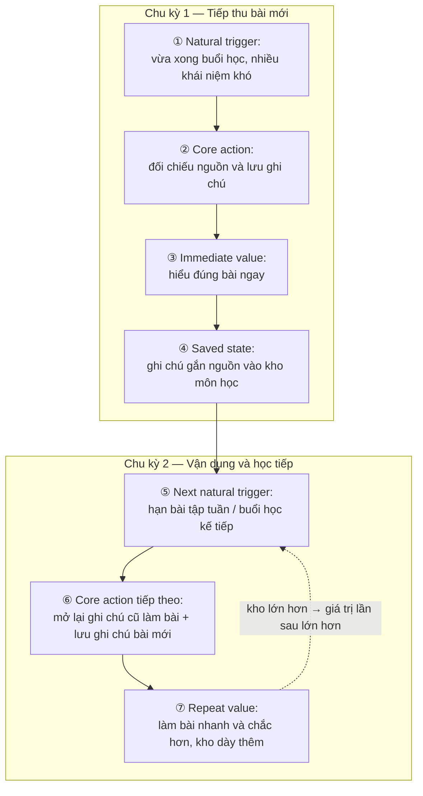

# Track1_Day20_2A202602416_NguyenVanBien

## 1. Thông tin học viên & dự án

| | |
| :--- | :--- |
| **Họ và tên** | Nguyễn Văn Biển |
| **MHV** | 2A202602416 |
| **Hình thức** | Bài cá nhân |
| **Dự án chọn làm** | **AI Notes** — trợ lý ghi chú học tập gắn ngữ cảnh nguồn (slide bài giảng / transcript) |
| **Use case phân tích sâu** | Sau buổi học, người học biến bản nháp giải thích của AI thành ghi chú đã đối chiếu nguồn để dùng khi làm bài tập tuần và ôn thi |

---

## 2. Link tệp Metrics Pack (đã cấp quyền xem)

- 🔗 **Metrics Pack (00 → 06):** [github.com/nguyenbien8/Track1_Day20_2A202602416_NguyenVanBien#metrics-pack](https://github.com/nguyenbien8/Track1_Day20_2A202602416_NguyenVanBien#metrics-pack) — repo public, ai có link đều xem được.
- 📝 **AI Support Log:** [ai-support-log.md](ai-support-log.md)

> Metrics Pack được trình bày trực tiếp ở [Mục 4](#metrics-pack) của README này để người chấm đọc ngay trên GitHub, không cần mở tệp ngoài.

---

## 3. Điều tôi mang về áp dụng cho dự án thật

1. **Nature trước, nurture sau.** Trước đây tôi hay mặc định đo DAU/MAU và dùng push notification để "kéo user quay lại mỗi ngày". Giờ tôi hiểu nurture chỉ khuếch đại nhịp có sẵn, không tạo ra được nhịp không tồn tại. Sinh viên học theo tuần thì AI Notes đo theo tuần. Nếu ép daily, tôi chỉ có số ảo và notification gây phiền.
2. **Thao tác UI, output của AI và value của user là ba thứ khác nhau.** User mở app, hay AI sinh 100 trang tóm tắt, đều chưa chứng minh được value. Value chỉ xảy ra khi người học đối chiếu nguồn và giữ lại một ghi chú họ tin là đúng. Từ nay, với mọi tính năng GenAI trong dự án, tôi sẽ hỏi trước: "user đã *làm gì* với output này?"
3. **Kỷ luật định nghĩa metric và tracking.** Tôi không nói "D7 retention 30%" nữa. Mỗi retention phải đủ 6 thành phần (unit, cohort entry, return event, window, threshold, segment). Mỗi event phải tính được ít nhất một metric, và ngược lại mỗi metric phải có event để tính. Event chỉ bắn khi server đã ghi nhận hành vi hoàn tất, và có khóa chống trùng khi reload/retry.
4. **Không dùng số liệu không có nguồn.** Benchmark và baseline retention sẽ lấy từ chính cohort học kỳ đầu của sản phẩm, không mượn con số "tham khảo" trôi nổi.

---

## 4. Metrics Pack

Chuỗi quyết định: **Core action (01) → Cadence (02) → Metric + Retention (03–04) → Loop + hypothesis (05) → Tracking (06)**. Mỗi mục dùng lại kết quả của mục trước.

---

### 00 — Dự án, persona, core job

| Mục | Nội dung |
| :--- | :--- |
| **Dự án** | **AI Notes:** sinh viên tải slide / transcript bài giảng lên; AI tạo bản nháp giải thích khái niệm kèm trích dẫn tới đúng trang slide hoặc đoạn transcript; người học đối chiếu, chỉnh sửa và lưu thành kho ghi chú theo môn. |
| **Persona** | **Minh**, sinh viên năm 3 khối kỹ thuật. Học 4–5 môn/tuần, mỗi buổi 50–100 slide với nhiều thuật ngữ mới. Trên lớp không kịp vừa nghe vừa ghi; cuối tuần xem lại ảnh chụp slide thì không nhớ ngữ cảnh. Sợ AI "bịa" khiến mình học sai trước kỳ thi. |
| **Core job** (lời người dùng) | *"Khi gặp khái niệm khó trong bài giảng dồn dập, tôi muốn hiểu đúng và giữ lại lời giải thích gắn với đúng trang tài liệu gốc, để khi làm bài tập tuần và ôn thi tôi dùng được ngay mà không sợ hiểu sai hay phải lục lại cả trăm trang slide."* |

> Tránh bẫy: không viết "cần một chatbot AI tóm tắt bài giảng", vì đó là tính năng, không phải core job.

---

### 01 — Core Action Card (+ tự kiểm 5 tiêu chí)

#### 1. Phân biệt 4 khái niệm

| Khái niệm | Câu hỏi | AI Notes |
| :--- | :--- | :--- |
| **Core job** | User đang cố hoàn thành việc gì? | Hiểu đúng khái niệm khó và có tài liệu đáng tin để làm bài tập tuần và ôn thi. |
| **Core action** | User làm gì trong sản phẩm để tiến tới giá trị? | **Lưu một ghi chú đã đối chiếu nguồn** (*verified note*). |
| **Core value** | User nhận được lợi ích gì? | Hiểu đúng bài ngay sau buổi học; có kho ghi chú tin cậy, bấm vào là thấy trang nguồn khi làm bài. |
| **Core value event** | Sự kiện nào chứng minh value đã xảy ra? | `note_saved` với `is_verified = true`. Value tích lũy được xác nhận thêm bằng `note_reopened` khi làm bài / ôn thi. |

#### 2. Core Action Card

| Thành phần | Câu trả lời |
| :--- | :--- |
| **Target user** | Learner cá nhân (sinh viên đang trong học kỳ). |
| **Core job** | Hiểu đúng khái niệm khó và giữ lại lời giải thích có bằng chứng nguồn. |
| **Core action** | **Lưu một ghi chú đã đối chiếu nguồn.** |
| **Object** | *Contextual note* = nội dung giải thích (≥ 20 ký tự) + liên kết tới vị trí slide / transcript gốc (`source_anchor_id`). |
| **Preconditions** | Tài liệu bài giảng đã tải lên; AI đã tạo bản nháp có trích dẫn; learner đang mở bản nháp đó. |
| **Completion rule** | Server ghi nhận ghi chú chuyển từ **draft → saved** **và** thỏa cả 3 điều kiện: (1) `source_anchor_id` hợp lệ; (2) nội dung ≥ 20 ký tự; (3) learner đã mở panel nguồn của ghi chú đó tổng cộng ≥ 3 giây trước khi lưu. Thiếu (3) thì vẫn là lưu, nhưng **không** tính là core action (xem counter-metric UQSR). |
| **Core value** | Hiểu đúng bài; có tài liệu tin cậy để dùng ngay khi làm bài tập. |
| **Evidence of value** | Ghi chú có metadata nguồn đã đối chiếu nằm trong kho môn học **và** được mở lại khi làm bài tập / ôn thi. |
| **Candidate event** | `note_saved` (`is_verified = true`) |

#### 3. Tự kiểm 5 tiêu chí

| # | Tiêu chí | Kết quả | Lý do |
| :-: | :--- | :-: | :--- |
| 1 | Gần core value | ✅ Đạt | Khi action hoàn tất, learner đã đọc, đối chiếu nguồn và giữ lại lời giải thích mình tin là đúng. Đó chính là "hiểu đúng + có tài liệu tin cậy". Khác với "AI sinh tóm tắt" (output hệ thống) hay "hỏi AI" (thao tác UI), vốn chưa cho biết learner có hiểu hay giữ lại gì. |
| 2 | Có thể lặp lại | ✅ Đạt | Mỗi buổi học mới hay mỗi bài tập tuần mới đều sinh ra khái niệm khó mới, nên action xuất hiện lại tự nhiên. |
| 3 | Có thể quan sát | ✅ Đạt | Completion rule là chuyển trạng thái trên server với 3 điều kiện đo được (anchor, độ dài, thời gian mở nguồn). Không phụ thuộc vào cú click ở client. |
| 4 | Có ý nghĩa | ✅ Đạt | Số verified note tăng nghĩa là learner thực sự dùng sản phẩm để học. Rủi ro "lưu bừa" được counter-metric UQSR và ACEFR canh. |
| 5 | Có thể tác động | ✅ Đạt | Team cải thiện được: hiển thị nguồn song song, highlight đoạn trích liên quan, tăng tốc tạo bản nháp, giảm trích dẫn sai. |

> **Gate 1:** Actor = learner, object = contextual note, completion rule rõ ràng; đạt 5/5 tiêu chí. Đây không phải "mở app" hay "hỏi AI", vì hai thao tác đó có thể xảy ra mà learner chưa hiểu hay giữ lại được gì.

---

### 02 — Action Nature Card + kết luận cadence

#### 1. Action Nature Card

| Thành phần | Nature của hành vi |
| :--- | :--- |
| **Actor** | Learner cá nhân. |
| **Intent** | Hiểu bài vừa học trước khi quên ngữ cảnh; chuẩn bị cho bài tập tuần / kỳ thi. |
| **Trigger** | **Sự kiện bên ngoài:** buổi học theo thời khóa biểu (2–3 buổi có nội dung mới/tuần) và hạn nộp bài tập từ giảng viên. Không phải do hệ thống kích hoạt. |
| **Effort** | Trung bình: đọc bản nháp, mở slide gốc đối chiếu, sửa lại bằng lời mình. Khoảng vài phút cho mỗi ghi chú. |
| **Value timing** | **Kết hợp:** tức thì (hiểu bài ngay) và tích lũy (kho ghi chú dùng cho bài tập và ôn thi cuối kỳ). |
| **State** | Ghi chú lưu vĩnh viễn trong kho của môn học, kèm liên kết tới trang / đoạn nguồn. |
| **Dependency** | Cần giảng viên cung cấp slide / tài liệu; phụ thuộc lịch học và lịch thi của trường; gần như không có nhu cầu trong kỳ nghỉ. |
| **Repeat condition** | Có buổi học mới với khái niệm mới, hoặc đến hạn bài tập tuần / mùa ôn thi. |

#### 2. Dạng hành vi

**Theo chu kỳ (cyclical), tích lũy tiến trình qua từng tuần.** Nhu cầu bị kéo bởi lịch học tuần. Đây không phải thói quen hằng ngày: không môn nào học 7 ngày/tuần. Cũng không phải giao dịch một lần, vì kho ghi chú lớn dần qua cả học kỳ.

#### 3. Kết luận cadence

> **Đối với** sinh viên đang trong học kỳ, **core action** lưu ghi chú đã đối chiếu nguồn **thường xuất hiện** 2–3 ngày mỗi tuần, ngay sau các buổi học có nội dung mới và trước hạn bài tập tuần, **vì** lịch học tín chỉ và bài tập vận hành theo chu kỳ tuần. **Do đó, nhịp đo phù hợp là** hằng tuần (weekly) **ở cấp** cá nhân người học (user-level).

> **Gate 2:** Cadence lấy từ lịch học thật, không từ dashboard. Daily active hay số lần dùng nhiều hơn không đồng nghĩa với value cao hơn: learner xử lý xong bài trong một phiên ngắn mỗi tuần là tín hiệu tốt.

---

### 03 — Metric System

#### 1. Activation

| Thành phần | Định nghĩa |
| :--- | :--- |
| **Start event** | `material_uploaded` đầu tiên của user. |
| **Activation event** | `note_saved` đầu tiên với `is_verified = true` (core action đầu tiên). |
| **Time window** | ≤ 48 giờ kể từ start event. Lý do: với 2–3 buổi/tuần, 48 giờ là khoảng cách tới buổi học kế tiếp. Quá mốc này thì ngữ cảnh bài cũ đã nguội. |
| **Công thức** | Activation rate = số user có verified note đầu tiên trong ≤ 48h sau upload đầu tiên ÷ số user có upload đầu tiên (theo cohort tuần upload). |

> Không dùng "đăng ký", "đăng nhập" hay "xem hết onboarding" làm activation, vì lúc đó user chưa chạm core value.

#### 2. Engagement (2 góc)

1. **Frequency — Active Study Days per Week (ASDw):** số ngày trong tuần learner có ≥ 1 verified note. Kỳ vọng khớp nature là 2–3 ngày/tuần trong học kỳ. Đây là mục tiêu nội bộ, không phải benchmark ngoài.
2. **Depth — Source Verification Depth Ratio (SVDR):** tỉ lệ ghi chú được lưu có `source_view_ms ≥ 3000` trên tổng `note_saved`. Ngưỡng 3 giây trùng với điều kiện (3) trong completion rule.

#### 3. North Star Metric

**Weekly Verified Notes Saved (WVNS):** số ghi chú đã đối chiếu nguồn được lưu mỗi tuần.

| Thành phần công thức | Giá trị |
| :--- | :--- |
| **Unit of value** | Contextual note (ghi chú gắn nguồn). |
| **Quality threshold** | `is_verified = true`: có `source_anchor_id` hợp lệ, nội dung ≥ 20 ký tự, panel nguồn mở ≥ 3 giây trước khi lưu. Mỗi note chỉ đếm **một lần** (lần draft → saved đầu tiên). |
| **Frequency** | Hằng tuần, khớp kết luận cadence ở mục 02. |

> WVNS đo lượng tri thức đã được learner kiểm chứng, không phải lượng nội dung AI sinh ra. Spam "lưu tất cả" không làm WVNS tăng, vì note không mở nguồn sẽ có `is_verified = false`. Phần còn có thể bị game (mở nguồn cho đủ 3 giây rồi lưu) được counter-metric canh.

#### 4. Leading indicators (3)

| Chỉ số | Định nghĩa | Vì sao tin nó dự báo core action lặp lại |
| :--- | :--- | :--- |
| **Source click-through rate (SCTR)** | Số bản nháp có ≥ 1 `source_citation_viewed` ÷ số `ai_draft_generated` | Mở nguồn là bước bắt buộc trước một verified note. Learner có thói quen kiểm chứng thì nhiều khả năng sẽ hoàn tất action ở các tuần sau. *Giả thuyết, sẽ kiểm chứng bằng tương quan với W4 retention.* |
| **First-24h note rate (F24NR)** | Tỉ lệ tài liệu có ≥ 1 verified note trong 24h sau `material_uploaded` | Xử lý bài ngay trong ngày cho thấy sản phẩm đã gắn vào nhịp sau buổi học, tức đúng natural trigger. *Giả thuyết, cần đo.* |
| **Draft customization ratio (DCR)** | Tỉ lệ note có ≥ 1 `note_edited` trước khi `note_saved` | Sửa bằng lời mình là investment. Kho ghi chú càng "của mình" thì lý do quay lại dùng nó càng mạnh. *Giả thuyết, cần đo.* |

#### 5. Counter-metrics

| Counter-metric | Định nghĩa | Bảo vệ điều gì |
| :--- | :--- | :--- |
| **Unverified quick-save rate (UQSR)** | Số `note_saved` có `source_view_ms = 0` ÷ tổng `note_saved` | Nếu WVNS tăng mà UQSR cũng tăng, learner đang lưu mà không đọc. Kho ghi chú thành kho rác, nguy cơ học sai do AI bịa. |
| **Citation error report rate (CERR)** | Số note có `citation_error_reported` ÷ số verified note, theo tuần | Chất lượng trích dẫn của AI. Ngưỡng cảnh báo do team đặt nội bộ; baseline lấy từ học kỳ đầu. |
| **Inference cost per verified note (ICPVN)** | Tổng `llm_cost_usd` của `ai_draft_generated` ÷ số verified note | Tăng note mà chi phí LLM mỗi note tăng theo thì mô hình không bền khi scale. |

> **Gate 3:** Activation có start event, activation event và window. Retention đủ 6 thành phần (mục 04). NSM đủ 3 vế. Có 3 counter-metric.

---

### 04 — Retention Definition (6 thành phần)

| Thành phần | Định nghĩa | Lý do |
| :--- | :--- | :--- |
| **Unit** | User (`user_id`) | Sản phẩm phục vụ learner cá nhân. |
| **Cohort entry** | Tuần (ISO, giờ Việt Nam) của **verified note đầu tiên**, tức activation | Chỉ đo người đã chạm core value; tránh pha loãng bởi user chỉ đăng ký rồi bỏ. |
| **Return event** | ≥ 1 `note_saved` (`is_verified = true`) **hoặc** ≥ 1 `note_reopened` | Hai mặt của value: nạp thêm kiến thức mới, hoặc dùng lại ghi chú cũ khi làm bài / ôn thi. Mở lại ghi chú cũ cũng là value, đúng tinh thần tích lũy. |
| **Window** | **Tuần lịch W1…W8** sau tuần cohort (W0) | Khớp cadence weekly ở mục 02. Không dùng D7/D30 vì cửa sổ ngày không khớp lịch học tuần. |
| **Threshold** | ≥ 1 return event trong tuần | Nhu cầu tự nhiên là theo tuần; một phiên học thật mỗi tuần là đủ để coi learner còn ở lại. |
| **Segment** | Learner **đang trong học kỳ**, tách riêng các tuần nghỉ lễ / nghỉ hè; theo dõi thêm theo khối môn (kỹ thuật vs xã hội) | Tuần nghỉ không có trigger tự nhiên. Gộp chung vào sẽ khiến retention "rơi" giả. |

**Đọc retention so với 3 mốc (không so với con số cứng):**
- **Natural cycle:** đường retention nên đi ngang theo tuần học và nhô lên trước mùa thi, không phải giảm đều như app tiêu dùng hằng ngày.
- **Cohort đúng segment:** so cohort in-semester với cohort in-semester. So khối kỹ thuật với chính khối kỹ thuật ở học kỳ trước.
- **Category benchmark:** hiện **chưa có nguồn công khai đáng tin** cho công cụ ghi chú học tập có AI. Tôi không dùng con số tham khảo không nguồn; baseline sẽ lấy từ cohort học kỳ đầu.

---

### 05 — Product Loop (2 chu kỳ + metric hypothesis)

**Loại loop:** **progress loop.** Ghi chú lưu hôm nay trở thành công cụ làm bài tập tuần sau; kho càng lớn thì lý do quay lại càng mạnh.

*Dạng chữ:* buổi học xong → đối chiếu & lưu ghi chú → hiểu bài → ghi chú vào kho → hạn bài tập / buổi học mới → mở lại ghi chú + lưu ghi chú mới → làm bài chắc hơn, kho dày thêm → lặp lại.

**Reason to return nếu bỏ notification:** bài tập có hạn nộp thật và buổi học mới diễn ra theo thời khóa biểu (trigger tự nhiên). Kho ghi chú đã có sẵn lời giải thích kèm đúng trang slide (saved state). Notification nếu có chỉ nhắc đúng lúc trigger tự nhiên xảy ra, ví dụ "tối nay có buổi học, mở tài liệu mới?"; nó không tạo ra lý do quay lại.

**Metric hypothesis:**

> **Nếu** progress loop hoạt động đúng kỳ vọng, **metric** W4 retention (định nghĩa ở mục 04) của nhóm người học tích lũy ≥ 5 verified note trong 2 tuần đầu (W0–W1) **sẽ thay đổi theo hướng** duy trì cao hơn rõ rệt so với nhóm có < 5 note, **trong** học kỳ đầu tiên (theo dõi xuyên suốt 8 tuần sau launch), **vì** khi bước vào đợt deadline bài tập tuần ở W3–W4, người học đã có sẵn kho ghi chú chuẩn nguồn sẽ nhận thấy rõ giá trị tra cứu lại (`note_reopened`), từ đó có động lực tự thân tiếp tục xử lý các bài giảng mới mà không cần dựa dẫm vào push notification nhắc nhở.

*Cơ sở bảo vệ quyết định lõi (dành cho phản biện):*
- **Tại sao chọn mốc ≥ 5 verified note:** Trong 2 tuần đầu (W0–W1), sinh viên học khoảng 4–5 môn. Mốc 5 note đại diện cho việc người học đã kích hoạt core action thành công trên phần lớn các môn học, chứng minh sản phẩm đã bước đầu đi vào thói quen học tập thật.
- **Tại sao so sánh 2 nhóm thay vì đưa % cứng:** Sản phẩm mới chưa có historical baseline. Đưa ra con số % cụ thể (như 22% hay 38%) là bịa đặt không có nguồn. Việc so sánh đối chứng giữa nhóm đã tích lũy đủ kho tài liệu và nhóm chưa tích lũy là phương pháp khoa học nhất để chứng minh giá trị của progress loop.

> **Gate 4 (loop):** 2 chu kỳ, nối từ saved state sang next trigger. Hypothesis trỏ về W4 retention (mục 04), và về WVNS (mục 03) qua ngưỡng ≥ 5 verified note. Không dùng con số bịa đặt; có cơ sở bảo vệ vững chắc.

---

### 06 — Tracking nhanh (7 events + 2 acceptance criteria)

Mọi event bắn **từ server** sau khi trạng thái đã ghi vào DB, kèm `event_id` duy nhất, `user_id`, `timestamp` (UTC, quy đổi giờ Việt Nam khi chia tuần).

| Event | Ý nghĩa (điều đã xảy ra) | Thời điểm ghi nhận | Metric sử dụng |
| :--- | :--- | :--- | :--- |
| `material_uploaded` | Tài liệu bài giảng đã lưu thành công | Khi file lưu xong vào storage và bản ghi tài liệu được tạo (API trả `201`) | Activation (start event), F24NR |
| `ai_draft_generated` | AI đã tạo xong bản nháp có trích dẫn | Khi job sinh nháp hoàn tất và bản nháp được ghi DB; kèm `llm_cost_usd` | SCTR (mẫu số), ICPVN |
| `source_citation_viewed` | Learner đã xem nguồn của một bản nháp | Khi panel nguồn **đóng** (hoặc khi lưu note), nếu thời gian mở ≥ 1s; kèm `draft_id`, `view_ms` | SCTR, cộng dồn `source_view_ms` |
| `note_edited` | Learner đã sửa nội dung bản nháp | Khi bản nháp đã sửa được lưu ở server với thay đổi ≥ 5 ký tự so với bản AI; mỗi `draft_id` ghi tối đa 1 lần | DCR |
| `note_saved` | Ghi chú chuyển từ draft → saved | Khi `POST /api/v1/notes` commit DB xong (`201`). Properties: `note_id`, `source_anchor_id`, `content_length`, `source_view_ms`, `is_verified` (server tính theo completion rule) | **Core action, activation, NSM (WVNS), ASDw, SVDR, UQSR, retention (cohort entry + return)** |
| `note_reopened` | Learner mở lại một ghi chú đã lưu từ phiên trước | Khi trang chi tiết ghi chú tải xong, với note được lưu từ một ngày trước đó trở về trước; tối đa 1 lần / note / ngày | Retention (return event) |
| `citation_error_reported` | Learner báo trích dẫn sai trang / sai ý | Khi báo lỗi được ghi DB; tối đa 1 lần / (user, note) | CERR |

#### Acceptance criteria

**AC1 — Chỉ bắn khi hành vi hoàn tất.**
> Hệ thống **không** ghi `note_saved` khi learner vừa bấm nút "Lưu". Với mỗi `note_id`, `note_saved` chỉ được ghi sau khi `POST /api/v1/notes` đã commit DB và trả `201`, kèm `source_anchor_id` không rỗng và `content_length ≥ 20`. Request lỗi (mất mạng, 4xx, 5xx, timeout) không tạo event nào. `is_verified = true` chỉ khi `source_view_ms ≥ 3000` theo dữ liệu server, không theo giá trị client tự gửi lên.

**AC2 — Reload / retry / autosave không ghi trùng.**
> Với mỗi cặp `user_id` và `note_id`, hệ thống chỉ ghi `note_saved` **một lần duy nhất**, khi ghi chú chuyển từ draft sang saved, bất kể phiên đăng nhập. Tải lại trang, retry do rớt mạng (cùng idempotency key) hay autosave bản nháp đều không tạo thêm `note_saved`. Sửa và lưu lại một note đã saved không ghi `note_saved` mới, nên không cộng thêm vào WVNS.

> **Gate 4 (tracking):** 7 event, mỗi event map ít nhất 1 metric; mọi metric ở mục 03–04 đều có event để tính.

---

### Phụ lục — Tự soi lỗi (Gate 5) & revision

| Câu tự soi | Kết quả | Ghi chú |
| :--- | :-: | :--- |
| 1. Core action không phải thao tác UI hay output hệ thống? | ✅ | Lưu ghi chú *đã đối chiếu nguồn*, không phải "hỏi AI" hay "AI tạo tóm tắt". |
| 2. Activation không phải "xem hướng dẫn" hay "đăng nhập"? | ✅ | Verified note đầu tiên ≤ 48h sau upload. |
| 3. Frequency không cao hơn nhu cầu thật? | ✅ | Weekly, theo lịch học; không dùng DAU. |
| 4. Loop có reason to return ngoài notification? | ✅ | Hạn bài tập thật + kho ghi chú đã có sẵn. |
| 5. Retention không dùng chung window cho mọi cadence? | ✅ | Tuần lịch W1–W8, segment in-semester; không D7/D30. |
| 6. Mọi event đều map về một metric? | ✅ | Xem cột "Metric sử dụng" ở mục 06. |
| 7. Metric nào cũng có event để tính? | ✅ | Activation, ASDw, SVDR, WVNS, SCTR, F24NR, DCR, UQSR, CERR, ICPVN và retention đều có event nguồn. |

**Revision log:**

| # | Thay đổi | Lý do |
| :-: | :--- | :--- |
| R1 | Core action: "hỏi AI về bài giảng" → **lưu ghi chú đã đối chiếu nguồn**; NSM: "số câu hỏi mỗi ngày" → **WVNS** | "Hỏi AI" là thao tác UI, khuyến khích spam câu hỏi và không cho biết learner có hiểu bài không. "Mỗi ngày" trái với nhịp học theo tuần. |
| R2 | Event `note_verified_and_saved` → **`note_saved` + thuộc tính `is_verified`** | Nếu event chỉ bắn khi đã verify thì không đếm được các lần lưu *không* verify, tức không tính được counter-metric UQSR. |
| R3 | Thống nhất ngưỡng xác minh = **3 giây** ở completion rule, NSM, SVDR và AC1 | Bản trước lệch nhau (≥ 3s, ≥ 1s, ≥ 0ms), nên hai người đọc sẽ tính ra hai con số khác nhau. |
| R4 | Thêm event `citation_error_reported`, thuộc tính `llm_cost_usd`; thay `note_referenced_for_review` bằng `note_reopened` có quy tắc chống trùng | Counter-metric CERR và ICPVN trước đó không có event để tính. |
| R5 | Bỏ các số liệu không có nguồn (benchmark W4/W8, "gấp 3.2 lần", "cao hơn 80%", "tiết kiệm 70%", baseline 22% → 38%); hypothesis chuyển sang so sánh hai nhóm | Quy tắc lab cấm bịa benchmark. Baseline sẽ lấy từ cohort học kỳ đầu. |
| R6 | AC2: chống trùng theo `(user_id, note_id)` bất kể phiên, thay vì "trong cùng phiên" | Reload thường tạo phiên mới. Chống trùng theo phiên vẫn để lọt bản ghi trùng. |
